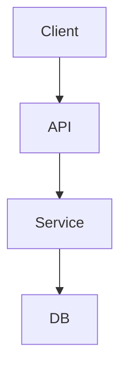

# [feature_name] Design

## Overview
- Context: <system context>
- Key decisions: <bullets>

## Architecture
- Pattern: <e.g., modular service>
- Diagram (optional):

## Components and Interfaces
- Component A
  - Purpose
  - Public interface (inputs/outputs)
- Component B
  - Purpose
  - Public interface

## Data Models
- Entities, fields, relations

## Error Handling
- Expected errors and strategies

## Testing Strategy
- Unit: <what to test>
- Integration: <what to cover>
- E2E: <if applicable>

