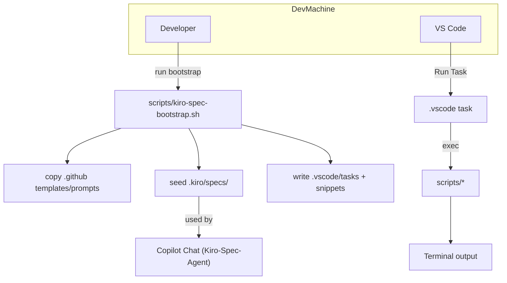
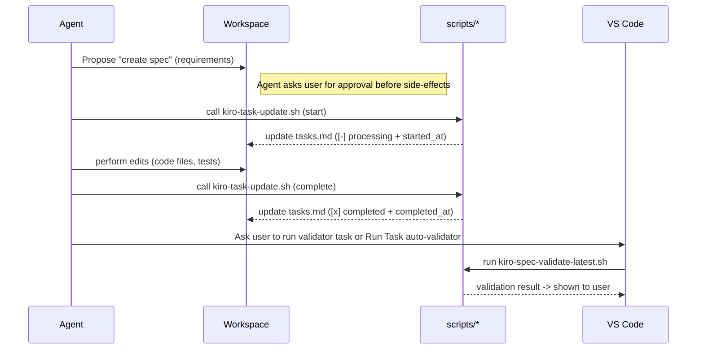

# Scripts reference — full details

This document expands the short README summary and documents every helper script shipped with this repo. It includes purpose, typical arguments, examples, and notes about safety and local/automation usage.

## Table of contents

- Overview
- Bootstrapping (`scripts/kiro-spec-bootstrap.sh`)
- Validation (`scripts/kiro-spec-validate.sh`, helpers)
- Task lifecycle (`scripts/kiro-task-update.sh`)
- Versioning & self-update
- Convenience wrapper & tests
- Diagrams
- Example outputs (samples)

## Overview

Files live in `scripts/` at the repo root. The helpers fall into these groups:

- Bootstrapping: `kiro-spec-bootstrap.sh`
- Validation: `kiro-spec-validate.sh`, `kiro-spec-validate-latest.sh`, `kiro-spec-validate-latest-task.sh`
- Task lifecycle: `kiro-task-update.sh`
- Versioning & update: `kiro-version.sh`, `kiro-bump-version.sh`, `kiro-self-update.sh`
- Convenience wrapper & tests: `kiro-cmd.sh`, `test-bootstrap.sh`

Each script is intentionally small and composable. Most support `--dry-run` or a non-destructive mode to preview changes.

---

## scripts/kiro-spec-bootstrap.sh

- Purpose: copy the repository's Copilot instruction files, templates, and validators into a target workspace; write `.vscode` helpers and, when requested, seed `.kiro/specs/<feature>` and `IMPLEMENTATION_PLAN.md`.
- Common arguments:
  - `--target <path>` (required for non-interactive)
  - `--feature <name>` (optional; creates `.kiro/specs/<name>`)
  - `--subroot <dir>` (optional; recorded in `.kiro/kiro-config.json`)
  - `--install-extensions` (uses `code` CLI when available)
  - `--yes` (skip final confirmation for automated runs)
  - `--dry-run` (no changes, prints planned actions)
  - `--emit-json <file>` (emit NDJSON actions as the script runs)

Example:

```bash
# interactive mode
bash scripts/kiro-spec-bootstrap.sh

# non-interactive (automation-friendly)
bash scripts/kiro-spec-bootstrap.sh --target /tmp/myproj --feature sample-feature --subroot app --yes --dry-run
```

Notes:
- `--emit-json` produces newline-delimited JSON useful for automation assertions.
- The script writes `VERSION` and helper scripts into the target so users can check tooling versions easily.

---

## scripts/kiro-spec-validate.sh

- Purpose: validate a feature's spec documents (Requirements, Design, Tasks) using EARS-style acceptance checks and repository Quality Gates.
- Usage: `scripts/kiro-spec-validate.sh <feature> <phase>` where `<phase>` is `requirements|design|tasks|all`.
- Output: prints human-friendly diagnostics and returns non-zero on validation failures.

Example:

```bash
bash scripts/kiro-spec-validate.sh sample-feature requirements
```

---

## scripts/kiro-spec-validate-latest.sh / kiro-spec-validate-latest-task.sh

- Purpose: convenience helpers that auto-detect the latest spec under `.kiro/specs` and run validators. The `-task` variant is intended for automation (non-interactive).

Example:

```bash
bash scripts/kiro-spec-validate-latest.sh design
bash scripts/kiro-spec-validate-latest-task.sh all
```

---

## scripts/kiro-task-update.sh

- Purpose: atomically update a numbered task entry inside `.kiro/specs/<feature>/tasks.md`.
- Behavior: sets task markers to `[-]` when starting and `[x]` on completion, and writes `started_by`, `started_at`, `completed_by`, `completed_at` metadata. It creates a `.bak` backup on update.
- Use case: called by an agent when it begins/finishes a task to keep a reliable audit trail.

Example (start):

```bash
python3 scripts/kiro-task-update.sh --spec-dir .kiro/specs/sample-feature --task 1 --action start --actor "AgentName"
```

Example (complete):

```bash
python3 scripts/kiro-task-update.sh --spec-dir .kiro/specs/sample-feature --task 1 --action complete --actor "AgentName"
```

---

## Versioning & self-update helpers

- `scripts/kiro-version.sh`
  - Prints the `VERSION` file content.

- `scripts/kiro-bump-version.sh`
  - Bump behavior: `--patch|--minor|--major` or set explicit value.
  - Supports `--dry-run` to preview the new value without writing.

- `scripts/kiro-self-update.sh`
  - Compares local `VERSION` to a remote raw `VERSION` endpoint. If newer, offers an interactive update flow (git fetch/merge or archive rsync). Supports `--dry-run`.

Example:

```bash
# show current
bash scripts/kiro-version.sh

# preview bump
bash scripts/kiro-bump-version.sh --patch --dry-run

# preview self-update
bash scripts/kiro-self-update.sh --dry-run
```

---

## scripts/kiro-cmd.sh

- Purpose: small interactive wrapper that maps short or slash-style aliases to the underlying helpers. It is intentionally lightweight so editors/snippets can call it.
- Example: run `scripts/kiro-cmd.sh` and type `version`, `self-update`, or `bump-patch` when prompted.

---

## scripts/test-bootstrap.sh

-- Purpose: smoke-test the bootstrap flow. Intended for local use or external automation to ensure the bootstrap flow remains functional.
-- Behavior: creates a temporary workspace, runs the bootstrap in dry-run mode, asserts that expected files are present, and exercises `kiro-task-update.sh`.

---

## Diagrams (copied from README)

Script interactions (high level)



Agent workflow (how an agent uses the tooling)



---

## Example outputs (short transcripts)

This section shows short, representative terminal outputs for the most-used commands in dry-run or safe preview modes. Times, paths and hostnames are illustrative.

### 1) Bootstrap (dry-run)

Command:

```bash
bash scripts/kiro-spec-bootstrap.sh --target /tmp/sample-ws --feature sample-feature --subroot app --dry-run
```

Sample output (abridged):

```text
DRY RUN: would copy .github/ to /tmp/sample-ws/.github/
DRY RUN: would create /tmp/sample-ws/.kiro/specs/sample-feature/requirements.md
DRY RUN: would write .vscode/tasks.json and .vscode/kiro-commands.code-snippets
DRY RUN: would record subroot "app" in .kiro/kiro-config.json
DRY RUN: planned 7 file writes, 3 directory creations
Preview complete — no files changed. Use --yes to apply changes.
```

### 2) Validate spec (happy path)

Command:

```bash
bash scripts/kiro-spec-validate.sh sample-feature requirements
```

Sample output (abridged):

```text
Validating requirements for feature: sample-feature
Checking presence: .kiro/specs/sample-feature/requirements.md ... OK
Running EARS acceptance checks (10 rules) ... 10 passed
Non-functional checks: README links, diagrams, and templates ... OK
Validation PASS — exit 0
```

### 3) Validate spec (failure example)

Command:

```bash
bash scripts/kiro-spec-validate.sh sample-feature design
```

Sample output (abridged):

```text
Validating design for feature: sample-feature
Rule: "Architecture section present" ... FAIL (missing 'Architecture' heading in design.md)
Rule: "Data models defined" ... WARN (no explicit models found)
Validation FAILED — 1 error, 1 warning
See .kiro/specs/sample-feature/design.md:23 for missing heading
```

### 4) Self-update (dry-run)

Command:

```bash
bash scripts/kiro-self-update.sh --dry-run
```

Sample output (abridged):

```text
Current VERSION: 1.2.3
Remote VERSION: 1.3.0
Action: would fetch updates from https://raw.githubusercontent.com/oliguo/vibe-coding-kiro-agent/main/VERSION
Action: would replace scripts/kiro-*.sh and update .vscode helpers
DRY RUN: no files changed. Run without --dry-run to perform update.
```

### 5) Bump version (preview)

Command:

```bash
bash scripts/kiro-bump-version.sh --patch --dry-run
```

Sample output:

```text
Current VERSION: 1.2.3
New VERSION (patch): 1.2.4
DRY RUN: would write VERSION with new value
```

### 6) Task update (start → complete)

Command (start):

```bash
python3 scripts/kiro-task-update.sh --spec-dir .kiro/specs/sample-feature --task 2 --action start --actor "oli-bot"
```

Sample before/after (diff-like view, abridged):

```text
Before:  - [ ] 2. Implement feature X
After:   - [-] 2. Implement feature X
  started_by: oli-bot
  started_at: 2025-08-15T12:34:56Z
```

Command (complete):

```bash
python3 scripts/kiro-task-update.sh --spec-dir .kiro/specs/sample-feature --task 2 --action complete --actor "oli-bot"
```

Sample after completion:

```text
  - [x] 2. Implement feature X
    started_by: oli-bot
    started_at: 2025-08-15T12:34:56Z
    completed_by: oli-bot
    completed_at: 2025-08-15T12:45:12Z
```

